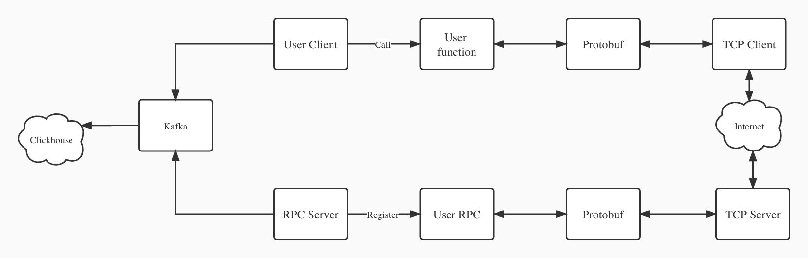

# Distributed high performance RPC framework
In LoboRPC, a client application can directly call a method on a server application on a different machine as if it were a local object, making it easier for you to create distributed applications and services.

This is an online filesystem based on LoboRPC. [Link](https://github.com/NiconicoGao/LoboFileSystem)

## Feature
- High-performance event loop based on **Epoll** and kqueue [Link](https://github.com/Allenxuxu/gev)
- Smaller, faster, and simpler serializing mechanism **Protobuf** [Link](https://developers.google.com/protocol-buffers)
- Blazing fast, structured, leveled logging **ZAP** [Link](https://github.com/uber-go/zap)
- Support service discovery by **ETCD** [Link](https://etcd.io/)
- Archive Log by **Kafka** and **Clickhouse** 

## Usage
1. Install Protoc 
> sudo apt install -y protobuf-compiler

2. Write your own RPC .proto file

See test/test.proto for example. **go_package** option is a requirement. 

3. Generate serializing code
> protoc -I=$SRC_DIR --go_out=$DST_DIR $SRC_DIR/test.proto

4. Implement Client and Server Interface

See test/test_client.go and test/test_rpc.go for example 

5. Implement your main function.

See /cmd for example

## Code Description
    cmd: main function of RPC client and server 
    lobo: RPC Server Core 
    test: User customized RPC file

## Architecture

## Author 
Lobo Rabbit
